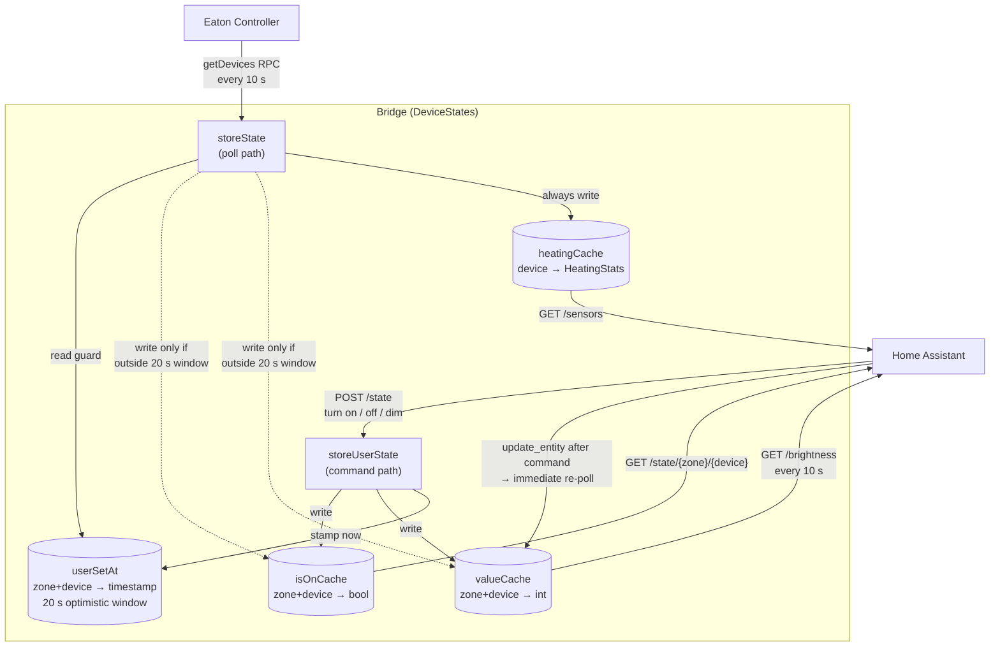

HOME console
============

[](https://github.com/MortalFlesh/home-console/actions/workflows/checks.yaml)

> Console application to help with home automations.

## Run statically

First compile
```sh
fake build target release
```

Then run
```sh
dist/home-console help
```

List commands
```sh
dist/home-console list
```

---
### Development

First run `./build.sh` or `./build.sh -t watch`

List commands
```sh
bin/console list
```

Run tests locally
```sh
fake build target Tests
```

---

## Generated HA YAML examples

The index page (`http://<host>:28080/`) generates ready-to-paste Home Assistant YAML for each device class. Below are representative examples using `192.168.1.10:28080` as the add-on host and `hz_1` / `xCo_9214125_u0` as placeholder zone / device ids.

### Sensors

```yaml
sensor:
  - platform: rest
    resource: http://192.168.1.10:28080/sensors
    scan_interval: 60
    name: eaton
    value_template: OK
    json_attributes_path: "$.sensors"
    json_attributes:   # NOTE: Add only sensors you want to use
      - hdm_xComfort_Adapter_9214125_u0

template:
  - sensor:
      - unique_id: eaton_living_room_temperature
        name: "Living Room Temperature"
        state: "{{ state_attr('sensor.eaton', 'hdm_xComfort_Adapter_9214125_u0')['temperature'] | float }}"
        unit_of_measurement: "°C"
        device_class: temperature
```

### Switches

```yaml
switch:
  - platform: rest
    name: Eaton - Living Room Light
    resource: http://192.168.1.10:28080/state
    state_resource: http://192.168.1.10:28080/state/hz_1/xCo:9214125_u0
    body_on: '{"room": "hz_1", "device": "xCo:9214125_u0", "state": "on"}'
    body_off: '{"room": "hz_1", "device": "xCo:9214125_u0", "state": "off"}'
    is_on_template: '{{ value_json.state }}'
    headers:
      Content-Type: application/json
```

### Covers (shutters / blinds / awnings)

```yaml
rest_command:
  eaton_hdm_xComfort_Adapter_9214125_u0_open:
    url: "http://192.168.1.10:28080/state"
    method: POST
    headers:
      Content-Type: application/json
    payload: '{"room": "hz_1", "device": "xCo:9214125_u0", "state": "open"}'
  eaton_hdm_xComfort_Adapter_9214125_u0_close:
    url: "http://192.168.1.10:28080/state"
    method: POST
    headers:
      Content-Type: application/json
    payload: '{"room": "hz_1", "device": "xCo:9214125_u0", "state": "close"}'
  eaton_hdm_xComfort_Adapter_9214125_u0_stop:
    url: "http://192.168.1.10:28080/state"
    method: POST
    headers:
      Content-Type: application/json
    payload: '{"room": "hz_1", "device": "xCo:9214125_u0", "state": "stop"}'

cover:
  - platform: template
    covers:
      eaton_cover_hdm_xComfort_Adapter_9214125_u0:
        friendly_name: "Living Room Blind"
        open_cover:
          action: rest_command.eaton_hdm_xComfort_Adapter_9214125_u0_open
        close_cover:
          action: rest_command.eaton_hdm_xComfort_Adapter_9214125_u0_close
        stop_cover:
          action: rest_command.eaton_hdm_xComfort_Adapter_9214125_u0_stop
```

### Lights (dimmers)

Dimmers are exposed as `light` template entities with full brightness control. The brightness state is read back from a single aggregated REST sensor (`sensor.eaton_brightness`) polled every 10 s, so physical or Eaton-app changes are reflected in HA within one poll cycle. Each command also fires `homeassistant.update_entity` so HA re-reads the state immediately, and the bridge keeps a 20 s optimistic window (see [State & cache flow](#state--cache-flow)) so a freshly-set value is not overwritten by a stale controller poll.

```yaml
sensor:
  - platform: rest
    resource: http://192.168.1.10:28080/brightness
    scan_interval: 10
    name: eaton_brightness
    value_template: OK
    json_attributes_path: "$.Brightness"
    json_attributes:
      - hdm_xComfort_Adapter_9214125_u0

rest_command:
  eaton_hdm_xComfort_Adapter_9214125_u0_set_level:
    url: "http://192.168.1.10:28080/state"
    method: POST
    headers:
      Content-Type: application/json
    payload: '{"room": "hz_1", "device": "xCo:9214125_u0", "density": {{ brightness_pct }}}'

template:
  - light:
      - name: "Living Room Dimmer"
        default_entity_id: light.eaton_light_hdm_xComfort_Adapter_9214125_u0
        level: >-
          {{ (state_attr('sensor.eaton_brightness', 'hdm_xComfort_Adapter_9214125_u0') | int(0)) * 255 / 100 }}
        state: "{{ (state_attr('sensor.eaton_brightness', 'hdm_xComfort_Adapter_9214125_u0') | int(0)) > 0 }}"
        turn_on:
          - action: rest_command.eaton_hdm_xComfort_Adapter_9214125_u0_set_level
            data:
              brightness_pct: 100
          - action: homeassistant.update_entity
            target:
              entity_id: sensor.eaton_brightness
        turn_off:
          - action: rest_command.eaton_hdm_xComfort_Adapter_9214125_u0_set_level
            data:
              brightness_pct: 0
          - action: homeassistant.update_entity
            target:
              entity_id: sensor.eaton_brightness
        set_level:
          - action: rest_command.eaton_hdm_xComfort_Adapter_9214125_u0_set_level
            data:
              brightness_pct: "{{ (brightness / 255 * 100) | round(0) }}"
          - action: homeassistant.update_entity
            target:
              entity_id: sensor.eaton_brightness
```

### Climate (floor heating)

Each room controller generates three YAML blocks. `GET /climate/{zone}` returns the live temperature and setpoint; `POST /climate` accepts `{"room": "<zone>", "temperature": <value>}` and adjusts the Eaton setpoint in 0.5 °C steps.

```yaml
sensor:
  - platform: rest
    resource: http://192.168.1.10:28080/climate/hz_5
    scan_interval: 60
    name: eaton_climate_hdm_xComfort_Adapter_9214125
    value_template: "{{ value_json.Temperature }}"
    json_attributes:
      - Temperature
      - Setpoint

rest_command:
  eaton_climate_hdm_xComfort_Adapter_9214125_set_temp:
    url: "http://192.168.1.10:28080/climate"
    method: POST
    headers:
      Content-Type: application/json
    payload: '{"room": "hz_5", "temperature": {{ temperature }}}'

climate:
  - platform: template
    climates:
      eaton_climate_hdm_xComfort_Adapter_9214125:
        friendly_name: "Living Room Thermostat"
        current_temperature_template: "{{ state_attr('sensor.eaton_climate_hdm_xComfort_Adapter_9214125', 'Temperature') | float(0) }}"
        target_temperature_template: "{{ state_attr('sensor.eaton_climate_hdm_xComfort_Adapter_9214125', 'Setpoint') | float(0) }}"
        hvac_modes:
          - heat
        hvac_mode_template: "heat"
        set_temperature:
          action: rest_command.eaton_climate_hdm_xComfort_Adapter_9214125_set_temp
          data:
            temperature: "{{ temperature }}"
        min_temp: 5
        max_temp: 30
        target_temp_step: 0.5
```

---

## State & cache flow


